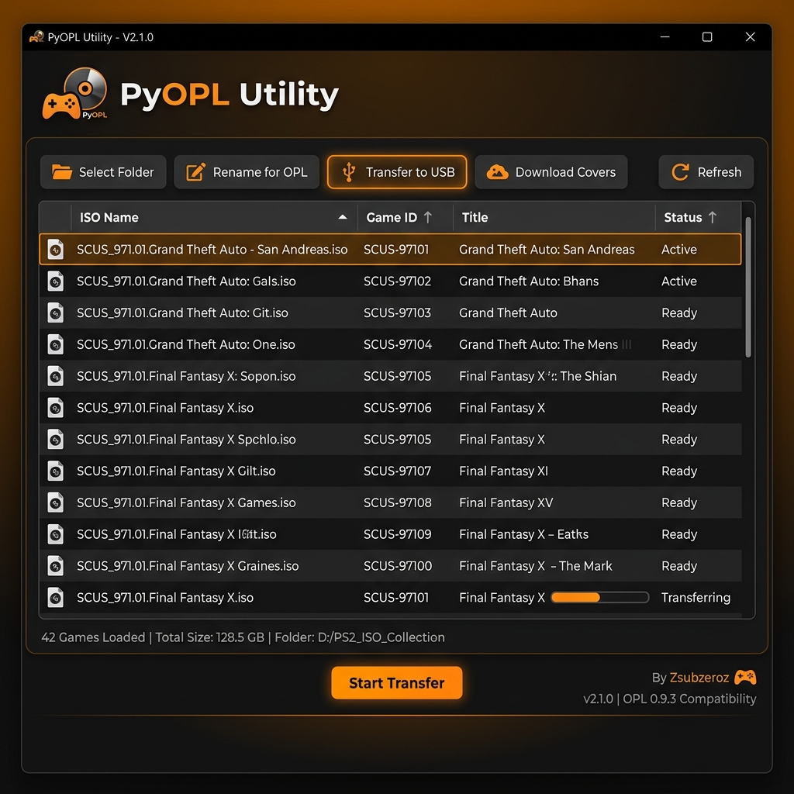

# 🎮 PyOPL Utility

[](https://www.python.org/downloads/)
[](https://opensource.org/licenses/MIT)
[](https://www.riverbankcomputing.com/software/pyqt/)

A premium, fast, and modern desktop utility designed to manage PlayStation 2 games for Open PS2 Loader (OPL). Easily transfer your ISOs to USB drives, automatically rename them to the OPL standard, and download high-quality cover art.

---

## ✨ Features

- **🚀 Ultra-Fast Transfer**: Direct copy for ISOs < 4GB and automatic splitting for ISOs > 4GB.
- **🧩 OPL Compatibility**: Automatically generates `ul.cfg` for split games and follows the `GAME_ID.Name.iso` naming convention.
- **🖼️ Auto-Cover Downloader**: One-click download for high-quality PS2 covers from the [xlenore/ps2-covers](https://github.com/xlenore/ps2-covers) repository.
- **🔍 Intelligent Scanning**: Automatically extracts Game IDs (e.g., SLUS_210.66) directly from the ISO files.
- **💾 USB Detection**: Auto-detects connected USB drives and checks for available space.
- **🎨 Modern UI**: Beautiful "Dark Amber" theme powered by `qt-material` and professional icons by `FontAwesome`.

---

## 🛠️ Installation

### Prerequisites
- Python 3.8 or higher
- `pip` (Python package manager)

### Setup
1. Clone the repository:
   ```bash
   git clone https://github.com/Zsubzeroz/PyOPL-Utility.git
   cd PyOPL-Utility
   ```
2. Create a virtual environment and install dependencies:
   ```bash
   python -m venv venv
   source venv/bin/activate  # On Windows: venv\Scripts\activate
   pip install -r requirements.txt
   ```

---

## 🚀 How to Use

1. **Launch the app**: `python app.py`
2. **Select Folder**: Click "Selecionar Pasta" and point to where your PS2 ISOs are stored.
3. **Scan**: Click "Atualizar" to list the games and extract their IDs.
4. **Rename (Optional)**: Select games and click "Renomear p/ OPL" to format filenames correctly.
5. **Transfer**: Select a game and click "Transferir p/ USB". Select your USB drive root.
6. **Download Covers**: Select games and click "Baixar Capas" to fetch artwork to the `ART` folder on your USB.

---

## 📸 Screenshots



---

## 📝 License

Distributed under the MIT License. See `LICENSE` for more information.

---

## 🤝 Contributing

Contributions are what make the open source community such an amazing place to learn, inspire, and create. Any contributions you make are **greatly appreciated**.

1. Fork the Project
2. Create your Feature Branch (`git checkout -b feature/AmazingFeature`)
3. Commit your Changes (`git commit -m 'Add some AmazingFeature'`)
4. Push to the Branch (`git push origin feature/AmazingFeature`)
5. Open a Pull Request

---

**Developed with ❤️ by [Luan Estifer (Zsubzeroz)](https://github.com/Zsubzeroz)**